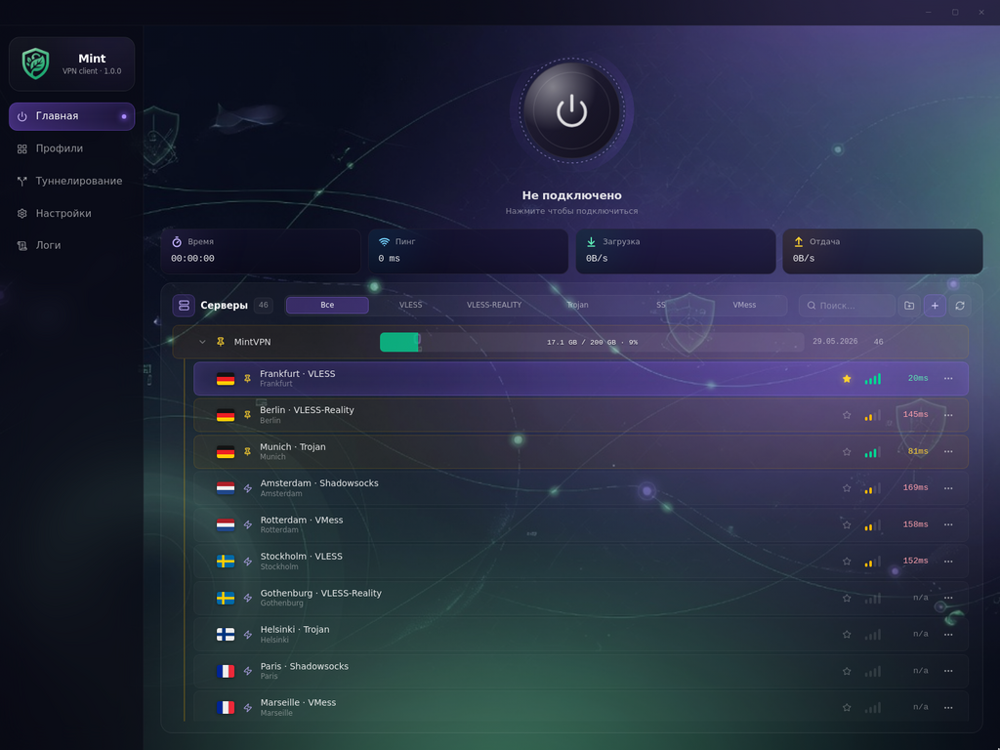

<div align="center">

<br>

<picture>
  
</picture>

<br>
<br>

<h1>Mint VPN</h1>

<h4>Fast. Private. Beautiful.<br>A premium VPN client for Windows &amp; Android.</h4>

<br>

<a href="https://getmint.club">
  
</a>&nbsp;
<a href="https://github.com/M1ntVPN/MintVPN/actions/workflows/build.yml">
  
</a>&nbsp;
<a href="https://github.com/M1ntVPN/MintVPN/releases">
  
</a>

<br>
<br>

<a href="https://github.com/M1ntVPN/MintVPN"></a>
<a href="https://github.com/M1ntVPN/MintVPN/network/members"></a>
<a href="https://github.com/M1ntVPN/MintVPN/issues"></a>
<a href="https://github.com/M1ntVPN/MintVPN/commits/main"></a>
<a href="https://github.com/M1ntVPN/MintVPN/actions/workflows/build.yml"></a>

<a href="https://tauri.app"></a>
<a href="https://react.dev"></a>
<a href="https://www.typescriptlang.org"></a>
<a href="https://www.rust-lang.org"></a>
<a href="https://tailwindcss.com"></a>
<a href="https://github.com/SagerNet/sing-box"></a>


<br>
<br>



</div>

<br>

---

<br>

## Why Mint?

<table>
<tr>
<td width="50%" valign="top">

### &#x1F6E1;&#xFE0F; Multi-Protocol Engine
Powered by [sing-box](https://github.com/SagerNet/sing-box) core.
Supports **VLESS** &middot; **VMess** &middot; **Trojan** &middot; **Shadowsocks** &middot; **Reality** out of the box.

### &#x1F9E9; Smart Split Tunneling
Route traffic per-app, per-folder, or per-CIDR.
Pick from installed apps or live running processes.

### &#x1F512; Kill Switch
Hardware-level protection &mdash; Windows Firewall blocks **all** egress unless it goes through the VPN tunnel.

### &#x1F310; Multi-Hop
Chain multiple servers for an additional layer of anonymity.

</td>
<td width="50%" valign="top">

### &#x1F4E5; Universal Import
Paste a share-URI list, Base64 blob, Clash YAML, or native sing-box JSON &mdash; everything auto-detected.

### &#x1F3A8; Premium UI / UX
Frameless dark window, iOS-style fold animations, live RTT ping, traffic quota bar, customizable accent themes.

### &#x1F504; Auto Updates
Built-in updater checks for new releases and installs seamlessly in-app.

### &#x1F4BB; System Integration
Minimize to system tray, launch on Windows startup, native notifications.

</td>
</tr>
</table>

<br>

## Download

<div align="center">

<table>
<tr>
<th align="center">Platform</th>
<th align="center">Download</th>
<th align="center">Requirements</th>
</tr>
<tr>
<td align="center">

</td>
<td align="center">
<a href="https://github.com/M1ntVPN/MintVPN/actions/workflows/build.yml"></a>&ensp;<a href="https://github.com/M1ntVPN/MintVPN/actions/workflows/build.yml"></a>
</td>
<td align="center">Windows 10 (1809+) / 11, x64</td>
</tr>
<tr>
<td align="center">

</td>
<td align="center">

</td>
<td align="center">Android 7.0+ (API 24)</td>
</tr>
</table>

<br>

<a href="https://getmint.club">

</a>

<br>
<br>

<sub>Windows builds available in <a href="https://github.com/M1ntVPN/MintVPN/actions/workflows/build.yml">CI artifacts</a> &middot; Android APK coming soon &middot; <a href="https://getmint.club"><b>getmint.club</b></a></sub>

</div>

<br>

## Quick Start

```
1.  Launch Mint VPN
2.  Profiles  →  paste subscription URL  →  Import
3.  Pick a server
4.  Connect
```

<br>

## Tech Stack

| Layer | Technology |
|:--|:--|
| **Desktop shell** | [Tauri 2](https://tauri.app) &mdash; Rust |
| **Frontend** | [React 19](https://react.dev) &middot; Framer Motion &middot; Tailwind v4 &middot; Zustand |
| **VPN core** | [sing-box](https://github.com/SagerNet/sing-box) sidecar |
| **Mobile** | Tauri 2 Android &middot; Kotlin &middot; VpnService |
| **Tooling** | Vite 7 &middot; TypeScript 5.9 &middot; Cargo |
| **Installer** | NSIS &mdash; EN / RU language selector, LZMA compression |

<br>

## Development

```bash
git clone https://github.com/M1ntVPN/MintVPN.git && cd mint
npm install          # install frontend deps
npm run tauri:dev    # development mode with hot reload
npm run tauri:build  # production build → src-tauri/target/release/bundle/nsis/
```

**Prerequisites:** Node 20+, Rust stable, [Tauri v2 prerequisites](https://tauri.app/start/prerequisites/)

<br>

## Project Layout

```
mint/
├── src/                  # React UI
│   ├── components/       # Dashboard, Sidebar, Settings, Tunneling …
│   ├── store/            # Zustand stores (servers, settings, tunneling)
│   ├── engine/           # sing-box IPC layer
│   └── assets/           # Backgrounds, textures
├── src-tauri/            # Rust backend — Tauri commands, tray, firewall
├── .github/workflows/    # CI — build & publish
└── package.json
```

<br>

## License

[MIT](https://opensource.org/licenses/MIT) &copy; 2025 M1ntVPN

<br>

<div align="center">

<a href="https://getmint.club"><b>getmint.club</b></a>

<br>
<br>

<sub>Built with <a href="https://tauri.app">Tauri</a> &middot; Powered by <a href="https://github.com/SagerNet/sing-box">sing-box</a></sub>

</div>
